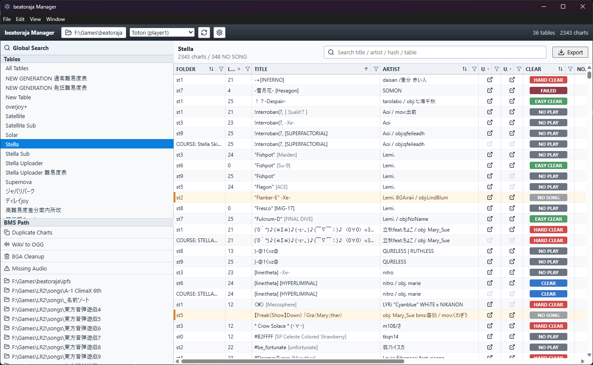

# beatoraja Chart Manager

[日本語 README](readme-ja.md)

beatoraja Chart Manager is a Windows app for viewing the grade and difficulty tables installed in beatoraja alongside your local chart library and clear statuses.

## Features

- Lists difficulty tables found in beatoraja's `table` folder
- Shows whether each chart in a table is available locally
- Displays clear statuses such as NO SONG, NO PLAY, FAILED, CLEAR, HARD CLEAR, and FULL COMBO
- Searches by title, artist, hash, table name, folder name, and more
- Filters by level, note count, clear status, URL availability, and more
- Browses locally available charts by BMS folder
- Opens chart distribution URLs, IR pages, and local folders from the context menu
- Same Song Search for finding charts that appear to be the same song or related variations
- Exports the selected table as `header.json` / `data.json`

## Running the Release Build

Extract the release zip, then run `beatoraja Chart Manager.exe`.

If beatoraja is not found automatically on first launch, choose it manually from `Select beatoraja` at the top of the window.

## License

This software is released under the GPL-3.0 license.
